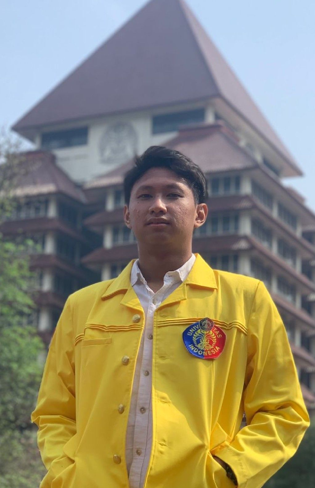

### Hi there 👋

## Vito Putra Sutarno

> Hi, Welcome to my profile

## About me

I am a passionate and dedicated individual with a strong interest in Sports and Information Technology.

## Contact Information

- **Email:** vitovitoboom12@gmail.com 
- **LinkedIn:** [Vito Putra Sutarno](https://www.linkedin.com/in/vitoputrasutarno/)
- **GitHub:** [vitooputraa](https://github.com/vitooputraa)
- **Instagram:** [vito.putra.s](https://instagram.com/vito.putra.s)

## Education

- **Bachelor Of Sains in Information System**
  Universitas Indonesia, 2022

## Work Experience

- **Student at RevoU Bootcamp**
  October 2023 - July 2024
  - Student at RevoU Software Engineering Section Seoul.

## Skills
 
- **Programming Languanges:** Python, Java, C.
- **Tools and Technologies:** Visual Studio Code, Unix, AVRStudio MFC.

## Projects

- **Kafe Daun-Daun Pacilkom**
  The project is a Python application for managing a cafe called "Kafe Daun-Daun Pacilkom." It provides various features for both customers and cafe staff.

## Interests

- E-Sport Mobile Legends Pro Scene
- Futsal
- BasketBall
- Badminton

Feel free to connect with me on [LinkedIn](https://www.linkedin.com/in/vitoputrasutarno/) to stay in touch and learn more about my junior in IT journey!.

